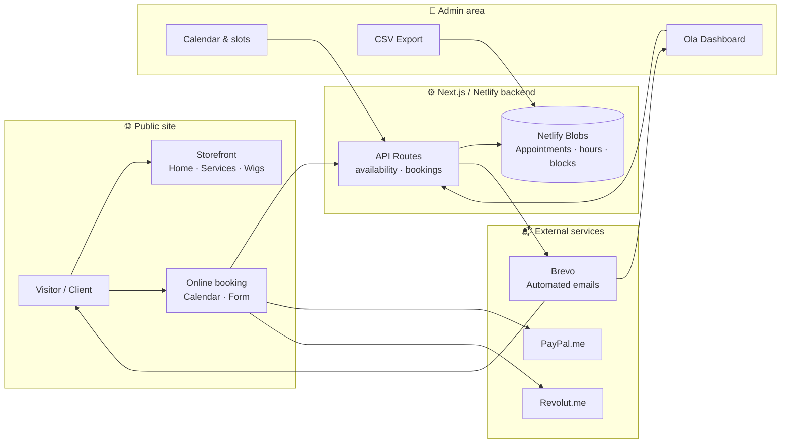
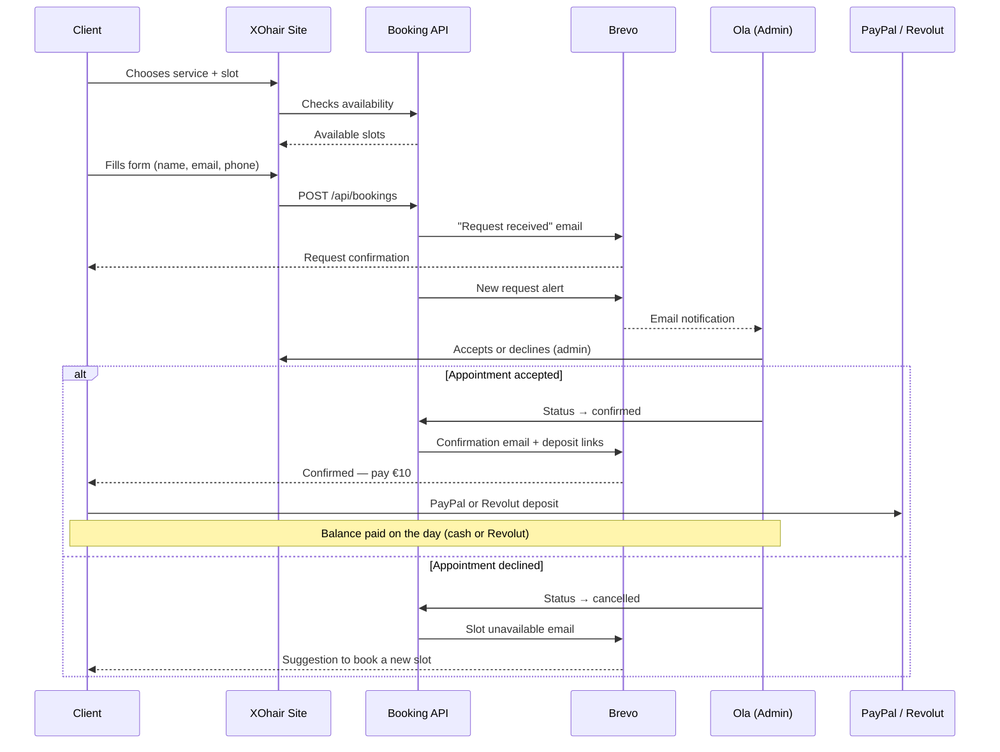

# Valuation Report — XOhair Melun Website

**Confidential document**  
**Date:** July 2026  
**Prepared for:** Ola / XOhair  
**Prepared by:** Alfred Ahoussinou  

---

## Table of Contents

1. [Executive summary](#1-executive-summary)
2. [XOhair project overview](#2-xohair-project-overview)
3. [Site architecture diagram](#3-site-architecture-diagram)
4. [Detailed feature inventory](#4-detailed-feature-inventory)
5. [Market comparison — price ranges in France](#5-market-comparison--price-ranges-in-france)
6. [Detailed valuation (€2,000 – €4,500)](#6-detailed-valuation-2000--4500)
7. [Typical rate for a junior developer (€1,500 – €3,000)](#7-typical-rate-for-a-junior-developer-1500--3000)
8. [Price agreed with Ola: €200](#8-price-agreed-with-ola-200)
9. [Included / not included](#9-included--not-included)
10. [Customer journey diagram](#10-customer-journey-diagram)

---

## 1. Executive summary

The **XOhair Melun** website is a professional, fully custom web application deployed in production on Netlify. It combines a polished storefront (video hero, service and wig catalogues, policies, Melun RER location) with a complete online booking system, an admin area for Ola, automated emails via Brevo, and a PayPal/Revolut deposit module.

| Indicator | Range |
|-----------|-------|
| **Estimated market value** | €2,000 – €4,500 |
| **Typical junior developer rate** | €1,500 – €3,000 |
| **Price agreed with Ola (symbolic)** | €200 |

For an equivalent deliverable on the French market, value typically ranges from **€2,000 to €4,500**. As a developer in the early stages of his career, an already reduced rate would be **€1,500 to €3,000**. Alfred nevertheless transfers the entire project to Ola for **€200** — a friendly gesture that does not reflect the real value of the work completed.

**In short:** Ola receives a professional, turnkey tool (storefront + booking + admin + emails + deposit), operational and documented, for an amount representing approximately 4 to 5% of the low end of market value.

---

## 2. XOhair project overview

### Context

**XOhair** is Ola's hair salon in **Melun (77000, France)**, specialising in melted lace wig installation, hair customisation, and Virgin hair extensions. Trained in London, Ola offers premium services in a professional setting, easily accessible from Paris via **RER D and R line** (Gare de Lyon → Melun).

### Website objectives

The website was designed to meet concrete salon needs:

| Objective | Implementation |
|-----------|----------------|
| **Professional visibility** | Elegant XOhair-branded storefront (black & copper), video hero, services and wigs presentation |
| **Reduce manual exchanges** | 24/7 online booking with automatically calculated time slots |
| **Centralise management** | Admin area: dashboard, calendar, accept/decline, CSV export |
| **Automate communication** | Transactional emails (request received, confirmation, decline) via Brevo |
| **Secure bookings** | €10 deposit via PayPal or Revolut before final confirmation |
| **Inform clients** | Clear policies (cancellation, lateness, appointment preparation) available online |

**Live site:** [xo-hair-melun.netlify.app](https://xo-hair-melun.netlify.app)  
**Instagram:** [@xo.haiir](https://www.instagram.com/xo.haiir/)

### Technical stack

| Component | Technology |
|-----------|------------|
| Framework | Next.js 15 (App Router) + React 19 + TypeScript |
| Hosting | Netlify (automatic builds, Netlify Blobs for data) |
| Emails | Brevo (REST API) with Resend fallback |
| Payments | PayPal.me and Revolut.me links (€10 deposit) |
| Source code | Private GitHub repository **XO-HAIR** |
| Documentation | Public repository **XO-HAIR-docs** (guides for Ola, no secrets) |

---

## 3. Site architecture diagram

The diagram below illustrates the overall flow: from the visitor on the site to emails, payments, and admin management.

**Reading the diagram:** the client browses the storefront or goes directly to booking. Available slots are calculated in real time via the API (no CDN cache). Each request is stored in Netlify Blobs, triggers Brevo emails, and appears in Ola's admin. The deposit is paid via configurable PayPal or Revolut links.

---

## 4. Detailed feature inventory

The table below lists all delivered modules, with an estimated market value per component.

| Module | Feature | Concrete description | Est. value |
|--------|---------|----------------------|------------|
| **Storefront — Home** | 8-clip video hero | Automatic rotation of 8 MP4 videos with crossfade, posters, London UK / Melun RER D & R badges, Book + Instagram CTAs | €350 – €600 |
| **Storefront — Services** | Service catalogue | 10 detailed services (price, duration, inclusions, prerequisites), 8 bookable online, pre-filled Book button | €200 – €400 |
| **Storefront — Wigs** | Catalogue & pricing | 7 visual models, pricing grid 6 categories × 6 lengths (€125–200), pre-order banners | €250 – €450 |
| **Storefront — Gallery** | Video portfolio | Infrastructure for 96 synced Instagram reels, gallery page with CTA to @xo.haiir | €150 – €300 |
| **Storefront — Info pages** | About, policies, footer | Ola's journey, 5 appointment policy sections (accordion), Melun location, per-page SEO | €150 – €250 |
| **Online booking** | Calendar & slots | 3-step form, monthly calendar, 30-min slots, 24h notice, 60-day horizon, overlap handling | €500 – €900 |
| **Online booking** | Brevo emails | 4 HTML email types: request received, Ola alert, confirmation (+ deposit links), decline; fallback relay | €200 – €400 |
| **Admin area** | Dashboard & calendar | Stats, week view, daily schedule, monthly calendar, day/slot/week blocking | €400 – €700 |
| **Admin area** | Appointment management | Search, filters, sorting, bulk actions, internal notes, status history, resend email | €300 – €500 |
| **Admin area** | Hours & export | Working days, breaks, slot interval settings; UTF-8 CSV export (semicolon separator) | €150 – €300 |
| **Payments** | PayPal/Revolut deposit | Configurable links, success page display, email and policy integration (€10, except hair drop-off) | €100 – €200 |
| **Hosting & deployment** | Netlify + config | Next.js build, environment variables, security headers, Blobs persistence, netlify.app domain | €150 – €300 |
| **Documentation** | Ola guides + public docs | GUIDE-Ola, admin, hours, Brevo, payments, policies — XO-HAIR-docs repository | €100 – €200 |
| | | **Estimated total** | **€3,000 – €5,300** |

> The range retained in section 6 (€2,000 – €4,500) incorporates negotiation margin and realistic positioning for a solo project, without agency or project management fees.

---

## 5. Market comparison — price ranges in France

To contextualise the XOhair valuation, here are reference points from the French web market (2025–2026) for comparable services.

| Service type | Price range (France) | Typically includes |
|--------------|------------------------|---------------------|
| **WordPress / Wix showcase site** | €800 – €2,000 | Template, 5–8 pages, contact form, hosting sometimes included for 1 year |
| **Custom showcase site (Next.js/React)** | €1,500 – €3,500 | Custom design, responsive, basic SEO, no back-office |
| **Booking module (Calendly, SimplyBook, etc.)** | €15 – €50/month (SaaS) or €500 – €1,500 (custom integration) | Time slots, reminders — often limited customisation |
| **Custom admin back-office** | €800 – €2,000 | Dashboard, CRUD, authentication, data export |
| **Transactional email integration** | €200 – €500 | HTML templates, provider (Brevo, SendGrid), 3–5 scenarios |
| **Deployment & production setup** | €200 – €500 | CI/CD, environment variables, basic monitoring |
| **Full agency web package** | €3,000 – €8,000 | Storefront + booking + admin + emails + 3–6 months support |
| **Junior freelancer (portfolio under construction)** | €1,500 – €3,000 | Reduced rate, variable quality, fewer contractual guarantees |
| **Experienced / senior freelancer** | €3,500 – €7,000 | Robust deliverable, documentation, best practices |

The XOhair project falls into the category **"custom storefront + booking + admin + emails"**, typically billed at **€2,500 – €5,000** by an experienced freelancer or small agency.

---

## 6. Detailed valuation (€2,000 – €4,500)

### Why this range?

The **€2,000 – €4,500** valuation is based on a module-by-module breakdown, adjusted to the project's real context:

| Module | Range | Justification |
|--------|-------|---------------|
| Complete storefront | €700 – €1,200 | Custom 8-clip hero, catalogues, policies, SEO, consistent black/copper design |
| Booking system | €600 – €1,100 | Real-time calendar, business rules (durations, overlaps, notice), dedicated API, no third-party SaaS |
| Admin area | €500 – €900 | ~2,450 lines of admin code: dashboard, calendar, bulk actions, hours settings |
| Automated emails | €200 – €400 | 4 HTML scenarios, Brevo + fallback, relay to Ola |
| Payments & policies | €100 – €200 | Deposit integration, legal pages, journey consistency |
| Hosting & deployment | €150 – €300 | Netlify, Blobs, production configuration |
| Documentation & handover | €100 – €200 | Operational guides, public docs repo, initial onboarding |
| **Total** | **€2,350 – €4,300** | Commercial rounding: **€2,000 – €4,500** |

### Value drivers

- **100% custom development** — no dependency on Calendly, WordPress, or other booking SaaS.
- **Rich admin panel** — visual calendar, slot blocking, CSV export, bulk management.
- **Dual email provider** — Brevo in production, Resend as fallback, automatic relay.
- **Instagram pipeline** — Python sync script for 96 reels (infrastructure ready).
- **Operational production** — site is live, tested, with real configurable data.

---

## 7. Typical rate for a junior developer (€1,500 – €3,000)

Alfred Ahoussinou is in the **early stages** of his career as a web developer. For a junior profile with a portfolio under construction, the market generally accepts rates 30 to 40% lower than an experienced freelancer.

| Criterion | Impact on rate |
|-----------|----------------|
| Limited portfolio | Lower range accepted by early adopter clients |
| Need for references | Preferential rate in exchange for testimonial / recommendation |
| Learning curve included | Research and iteration time not billed at senior rate |
| Relationship of trust | Project delivered in a friendly / family context |

**Honest range for this profile: €1,500 – €3,000**

Even at this "junior" rate, the XOhair project remains **below typical market value** for an equivalent deliverable, given its functional depth (admin, emails, booking, video hero, wig catalogue).

---

## 8. Price agreed with Ola: €200

### The amount

Despite a market valuation of **€2,000 – €4,500** (or **€1,500 – €3,000** at junior rate), Alfred transfers the entire project to Ola for:

## **€200**

### What this price represents

This amount is **not a commercial assessment** of the work completed. It is a **gesture of support** for the launch of XOhair, within a relationship of trust and closeness.

| In concrete terms | Equivalence |
|-------------------|-------------|
| **€200** | Approximately **4 to 5%** of the low end of market value |
| **Time invested** | Several weeks of development, design, testing, deployment, documentation |
| **What Ola receives** | A professional turnkey tool, operational, saving months of manual appointment management |
| **What Alfred does not bill** | Iterations, Brevo/Netlify setup, guide writing, initial support |

This price reflects a **desire to see the XOhair project succeed**, not an undervaluation of technical expertise. It is important that Ola understands the **real value** of what she receives, even though the price paid is symbolic.

---

## 9. Included / not included

### ✅ Included in handover

| Item | Detail |
|------|--------|
| Live site | [xo-hair-melun.netlify.app](https://xo-hair-melun.netlify.app) — operational on Netlify |
| Full source code | Access to private **XO-HAIR** repository (Next.js, admin, API, scripts) |
| Admin area | Dashboard, calendar, appointment management, hours, CSV export |
| Automated emails | Brevo configuration (4 scenarios), Netlify variables |
| Storefront pages | Home, services, wigs, gallery, about, policies, booking |
| Booking module | Calendar, slots, form, business rules |
| Deposit payments | PayPal.me and Revolut.me links integrated into the journey |
| Documentation | **XO-HAIR-docs** repository: GUIDE-Ola, admin, hours, Brevo, payments |
| Initial onboarding | Getting started via guides and direct support (credentials shared privately) |

### ❌ Not included

| Item | Detail |
|------|--------|
| Netlify hosting beyond free plan | Ola can stay on the free plan or upgrade if traffic is high |
| Paid Brevo subscription | Free plan covers current volumes; upgrade if needed |
| Custom domain name (e.g. xohair.fr) | Currently on netlify.app subdomain |
| Ongoing evolutionary maintenance | New features, redesigns — to be quoted separately |
| In-depth development training | Guides cover admin usage, not code |
| Sensitive credentials in this repo | Admin code, API keys: shared **privately** only |

---

## 10. Customer journey diagram

From first click to appointment confirmation, here is the complete client-side journey:

**In summary:** the client books independently, receives an immediate email, Ola validates from her admin, the client pays the deposit if accepted, and the appointment is confirmed. The entire flow is automated — Ola only needs to accept or decline.

---

## Final note

This report aims to **clarify the real value of the XOhair project** and the exceptional nature of the **€200** price. It does not constitute a legal contract. For any questions about day-to-day site usage, Ola can refer to the [Ola Guide](../GUIDE-Ola.md) and the **XO-HAIR-docs** repository documents.

---

*Prepared by Alfred Ahoussinou — July 2026*  
*Confidential document — XOhair*
