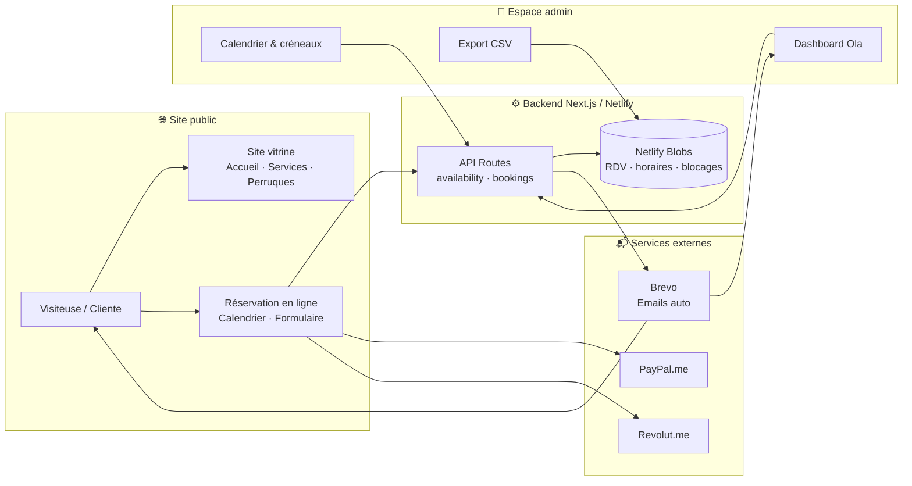
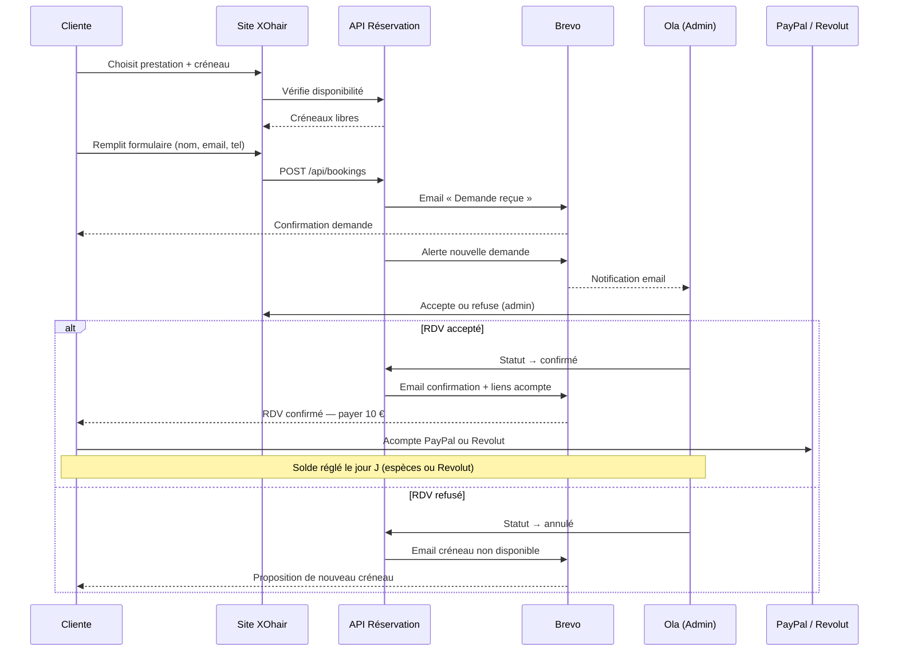

# Note de valorisation — Site web XOhair Melun

**Document confidentiel**  
**Date :** Juillet 2026  
**Pour :** Ola / XOhair  
**De :** Alfred Ahoussinou  

---

## Sommaire

1. [Résumé exécutif](#1-résumé-exécutif)
2. [Présentation du projet XOhair](#2-présentation-du-projet-xohair)
3. [Schéma d'architecture du site](#3-schéma-darchitecture-du-site)
4. [Inventaire détaillé des fonctionnalités](#4-inventaire-détaillé-des-fonctionnalités)
5. [Comparatif marché — fourchettes de prix en France](#5-comparatif-marché--fourchettes-de-prix-en-france)
6. [Valorisation détaillée (2 000 – 4 500 €)](#6-valorisation-détaillée-2-000--4-500-)
7. [Tarif habituel pour un développeur débutant (1 500 – 3 000 €)](#7-tarif-habituel-pour-un-développeur-débutant-1-500--3-000-)
8. [Prix accordé à Ola : 200 €](#8-prix-accordé-à-ola--200-)
9. [Ce qui est inclus / non inclus](#9-ce-qui-est-inclus--non-inclus)
10. [Schéma du parcours cliente](#10-schéma-du-parcours-cliente)

---

## 1. Résumé exécutif

Le site **XOhair Melun** est une application web professionnelle, entièrement développée sur mesure et déployée en production sur Netlify. Il combine une vitrine soignée (hero vidéo, catalogue prestations et perruques, politiques, localisation Melun RER) avec un système complet de réservation en ligne, un espace d'administration pour Ola, des emails automatiques via Brevo et un module d'acompte PayPal/Revolut. Pour un livrable équivalent sur le marché français, la valeur se situe entre **2 000 € et 4 500 €**. En tant que développeur en phase de démarrage, un tarif déjà réduit serait de **1 500 € à 3 000 €**. Alfred transmet néanmoins l'ensemble du projet à Ola pour **200 €**, geste amical qui ne reflète pas la valeur réelle du travail accompli.

---

## 2. Présentation du projet XOhair

### Contexte

**XOhair** est le salon de coiffure d'Ola à **Melun (77000)**, spécialisé dans la pose de perruques lace melted, la customisation capillaire et les mèches Virgin hair. Formée à Londres, Ola propose des prestations haut de gamme dans un cadre professionnel, facilement accessible depuis Paris via le **RER D et la ligne R** (Gare de Lyon → Melun).

### Objectifs du site

Le site web a été conçu pour répondre à des besoins concrets du salon :

| Objectif | Réalisation |
|----------|-------------|
| **Visibilité professionnelle** | Vitrine élégante aux couleurs XOhair (noir & cuivre), hero vidéo, présentation des services et perruques |
| **Réduire les échanges manuels** | Réservation en ligne 24 h/24 avec créneaux calculés automatiquement |
| **Centraliser la gestion** | Espace admin : tableau de bord, calendrier, acceptation/refus, export CSV |
| **Automatiser la communication** | Emails transactionnels (demande reçue, confirmation, refus) via Brevo |
| **Sécuriser les réservations** | Acompte de 10 € via PayPal ou Revolut avant confirmation définitive |
| **Informer les clientes** | Politiques claires (annulation, retards, préparation RDV) accessibles en ligne |

**Site en production :** [xo-hair-melun.netlify.app](https://xo-hair-melun.netlify.app)  
**Instagram :** [@xo.haiir](https://www.instagram.com/xo.haiir/)

### Stack technique

| Composant | Technologie |
|-----------|-------------|
| Framework | Next.js 15 (App Router) + React 19 + TypeScript |
| Hébergement | Netlify (build automatique, Netlify Blobs pour les données) |
| Emails | Brevo (API REST) avec fallback Resend |
| Paiements | Liens PayPal.me et Revolut.me (acompte 10 €) |
| Code source | Dépôt GitHub privé **XO-HAIR** |
| Documentation | Dépôt public **XO-HAIR-docs** (guides Ola, sans secrets) |

---

## 3. Schéma d'architecture du site

Le diagramme ci-dessous illustre le flux global : de la visiteuse sur le site jusqu'aux emails, paiements et gestion admin.

**Lecture du schéma :** la cliente navigue sur le site vitrine ou accède directement à la réservation. Les créneaux disponibles sont calculés en temps réel via l'API (sans cache CDN). Chaque demande est enregistrée dans Netlify Blobs, déclenche des emails Brevo, et apparaît dans l'admin d'Ola. L'acompte se règle via des liens PayPal ou Revolut configurables.

---

## 4. Inventaire détaillé des fonctionnalités

Le tableau suivant recense l'ensemble des modules livrés, avec une estimation de valeur marché par composant.

| Module | Fonctionnalité | Description concrète | Valeur estimée |
|--------|----------------|----------------------|----------------|
| **Site vitrine — Accueil** | Hero vidéo 8 clips | Rotation automatique de 8 vidéos MP4 avec crossfade, posters, badges Londres UK / Melun RER D & ligne R, CTA Réserver + Instagram | 350 – 600 € |
| **Site vitrine — Services** | Catalogue prestations | 10 prestations détaillées (prix, durée, inclusions, prérequis), 8 réservables en ligne, bouton Réserver pré-rempli | 200 – 400 € |
| **Site vitrine — Perruques** | Catalogue & tarifs | 7 modèles visuels, grille tarifaire 6 catégories × 6 longueurs (125–200 €), bannières précommande | 250 – 450 € |
| **Site vitrine — Galerie** | Portfolio vidéos | Infrastructure 96 reels Instagram synchronisés, page galerie avec CTA vers @xo.haiir | 150 – 300 € |
| **Site vitrine — Pages info** | À propos, politiques, footer | Parcours Ola, 5 sections politiques RDV (accordéon), localisation Melun, SEO par page | 150 – 250 € |
| **Réservation en ligne** | Calendrier & créneaux | Formulaire 3 étapes, calendrier mensuel, créneaux 30 min, préavis 24 h, horizon 60 jours, gestion chevauchements | 500 – 900 € |
| **Réservation en ligne** | Emails Brevo | 4 types d'emails HTML : demande reçue, alerte Ola, confirmation (+ liens acompte), refus ; relais de secours | 200 – 400 € |
| **Espace admin** | Dashboard & calendrier | Stats, vue semaine, planning du jour, calendrier mensuel, blocage jour/créneau/semaine | 400 – 700 € |
| **Espace admin** | Gestion RDV | Recherche, filtres, tri, actions groupées, notes internes, historique statuts, renvoi email | 300 – 500 € |
| **Espace admin** | Horaires & export | Réglages jours travaillés, pauses, intervalle créneaux ; export CSV UTF-8 (séparateur `;`) | 150 – 300 € |
| **Paiements** | Acompte PayPal/Revolut | Liens configurables, affichage page succès, intégration emails et politiques (10 €, sauf dépose mèches) | 100 – 200 € |
| **Hébergement & déploiement** | Netlify + config | Build Next.js, variables d'environnement, headers sécurité, persistance Blobs, domaine netlify.app | 150 – 300 € |
| **Documentation** | Guides Ola + docs publiques | GUIDE-Ola, admin, horaires, Brevo, paiements, politiques — dépôt XO-HAIR-docs | 100 – 200 € |
| | | **Total estimé** | **3 000 – 5 300 €** |

> La fourchette retenue en section 6 (2 000 – 4 500 €) intègre une marge de négociation et un positionnement réaliste pour un projet solo, sans agence ni frais de gestion de projet.

---

## 5. Comparatif marché — fourchettes de prix en France

Pour situer la valorisation XOhair, voici des repères du marché web français (2025–2026), pour des prestations comparables.

| Type de prestation | Fourchette de prix (France) | Ce que cela inclut généralement |
|--------------------|----------------------------|----------------------------------|
| **Site vitrine WordPress / Wix** | 800 – 2 000 € | Template, 5–8 pages, formulaire contact, hébergement 1 an parfois inclus |
| **Site vitrine sur mesure (Next.js/React)** | 1 500 – 3 500 € | Design custom, responsive, SEO de base, sans back-office |
| **Module de réservation (Calendly, SimplyBook, etc.)** | 15 – 50 €/mois (SaaS) ou 500 – 1 500 € (intégration sur mesure) | Créneaux, rappels — souvent limité en personnalisation |
| **Back-office admin sur mesure** | 800 – 2 000 € | Dashboard, CRUD, authentification, export données |
| **Intégration emails transactionnels** | 200 – 500 € | Templates HTML, provider (Brevo, SendGrid), 3–5 scénarios |
| **Déploiement & mise en production** | 200 – 500 € | CI/CD, variables d'env, monitoring de base |
| **Forfait agence web complète** | 3 000 – 8 000 € | Vitrine + réservation + admin + emails + 3–6 mois de support |
| **Freelance junior (portfolio en construction)** | 1 500 – 3 000 € | Tarif réduit, qualité variable, moins de garanties contractuelles |
| **Freelance confirmé / senior** | 3 500 – 7 000 € | Livrable robuste, documentation, bonnes pratiques |

Le projet XOhair se situe dans la catégorie **« site vitrine sur mesure + réservation + admin + emails »**, typiquement facturée **2 500 – 5 000 €** par un freelance confirmé ou une petite agence.

---

## 6. Valorisation détaillée (2 000 – 4 500 €)

### Pourquoi cette fourchette ?

La valorisation **2 000 – 4 500 €** repose sur une décomposition par module, ajustée au contexte réel du projet :

| Module | Fourchette | Justification |
|--------|------------|---------------|
| Site vitrine complet | 700 – 1 200 € | Hero vidéo custom (8 clips), catalogue services & perruques, politiques, SEO, design cohérent noir/cuivre |
| Système de réservation | 600 – 1 100 € | Calendrier temps réel, règles métier (durées, chevauchements, préavis), API dédiée, sans SaaS tiers |
| Espace admin | 500 – 900 € | ~2 450 lignes de code admin : dashboard, calendrier, bulk actions, paramètres horaires |
| Emails automatiques | 200 – 400 € | 4 scénarios HTML, Brevo + fallback, relais vers Ola |
| Paiements & politiques | 100 – 200 € | Intégration acompte, pages légales, cohérence parcours |
| Hébergement & déploiement | 150 – 300 € | Netlify, Blobs, configuration production |
| Documentation & transmission | 100 – 200 € | Guides opérationnels, dépôt docs public, accompagnement initial |
| **Total** | **2 350 – 4 300 €** | Arrondi commercial : **2 000 – 4 500 €** |

### Éléments qui renforcent la valeur

- **Développement 100 % sur mesure** — aucune dépendance à Calendly, WordPress ou autre SaaS de réservation.
- **Panel admin riche** — calendrier visuel, blocage de créneaux, export CSV, gestion groupée.
- **Double provider email** — Brevo en production, Resend en secours, relais automatique.
- **Pipeline Instagram** — script Python de synchronisation de 96 reels (infrastructure prête).
- **Production opérationnelle** — le site est en ligne, testé, avec données réelles configurables.

---

## 7. Tarif habituel pour un développeur débutant (1 500 – 3 000 €)

Alfred Ahoussinou est en **phase de démarrage** en tant que développeur web. Pour un profil junior avec un portfolio en construction, le marché accepte généralement des tarifs inférieurs de 30 à 40 % par rapport à un freelance confirmé.

| Critère | Impact sur le tarif |
|---------|---------------------|
| Portfolio limité | Fourchette basse acceptée par les clients early adopters |
| Besoin de références | Tarif préférentiel contre témoignage / recommandation |
| Courbe d'apprentissage incluse | Temps de recherche et d'itération non facturé au tarif senior |
| Relation de confiance | Projet réalisé dans un cadre amical / familial |

**Fourchette honnête pour ce profil : 1 500 – 3 000 €**

Même à ce tarif « débutant », le projet XOhair reste **en dessous de la valeur marchande** d'un livrable équivalent, compte tenu de la profondeur fonctionnelle (admin, emails, réservation, hero vidéo, catalogue perruques).

---

## 8. Prix accordé à Ola : 200 €

### Le montant

Malgré une valorisation marchande de **2 000 – 4 500 €** (ou **1 500 – 3 000 €** en tarif junior), Alfred transmet l'intégralité du projet à Ola pour :

## **200 €**

### Ce que ce prix représente

Ce montant n'est **pas une évaluation commerciale** du travail réalisé. Il s'agit d'un **geste de soutien** envers le lancement de XOhair, dans le cadre d'une relation de confiance et de proximité.

| En termes concrets | Équivalence |
|--------------------|-------------|
| **200 €** | Environ **4 à 5 %** de la valeur marchande basse |
| **Temps investi** | Plusieurs semaines de développement, design, tests, déploiement, documentation |
| **Ce qu'Ola reçoit** | Un outil professionnel clé en main, opérationnel, qui lui évite des mois de gestion manuelle des RDV |
| **Ce qu'Alfred ne facture pas** | Les itérations, la configuration Brevo/Netlify, la rédaction des guides, le support initial |

Ce prix reflète une **volonté de voir le projet XOhair réussir**, pas une sous-évaluation du savoir-faire technique. Il est important qu'Ola comprenne la **valeur réelle** de ce qu'elle reçoit, même si le prix payé est symbolique.

---

## 9. Ce qui est inclus / non inclus

### ✅ Inclus dans la transmission

| Élément | Détail |
|---------|--------|
| Site en production | [xo-hair-melun.netlify.app](https://xo-hair-melun.netlify.app) — opérationnel sur Netlify |
| Code source complet | Accès au dépôt privé **XO-HAIR** (Next.js, admin, API, scripts) |
| Espace admin | Dashboard, calendrier, gestion RDV, horaires, export CSV |
| Emails automatiques | Configuration Brevo (4 scénarios), variables Netlify |
| Pages vitrine | Accueil, services, perruques, galerie, à propos, politiques, réservation |
| Module de réservation | Calendrier, créneaux, formulaire, règles métier |
| Paiements acompte | Liens PayPal.me et Revolut.me intégrés au parcours |
| Documentation | Dépôt **XO-HAIR-docs** : GUIDE-Ola, admin, horaires, Brevo, paiements |
| Accompagnement initial | Prise en main via guides et support direct (identifiants transmis en privé) |

### ❌ Non inclus

| Élément | Précision |
|---------|-----------|
| Hébergement Netlify au-delà du plan gratuit | Ola pourra rester sur le plan free ou upgrader si trafic élevé |
| Abonnement Brevo payant | Le plan gratuit couvre les volumes actuels ; upgrade si besoin |
| Nom de domaine personnalisé (ex. xohair.fr) | Actuellement sur sous-domaine netlify.app |
| Maintenance évolutive continue | Nouvelles fonctionnalités, refontes — à chiffrer séparément |
| Formation approfondie au développement | Les guides couvrent l'usage admin, pas le code |
| Identifiants sensibles dans ce dépôt | Code admin, clés API : transmis **en privé** uniquement |

---

## 10. Schéma du parcours cliente

Du premier clic à la confirmation du rendez-vous, voici le parcours complet côté cliente :

**En résumé :** la cliente réserve en autonomie, reçoit un email immédiat, Ola valide depuis son admin, la cliente paie l'acompte si acceptée, et le rendez-vous est confirmé. Tout le flux est automatisé — Ola n'a qu'à accepter ou refuser.

---

## Remarque finale

Cette note a pour objectif de **clarifier la valeur réelle du projet XOhair** et le caractère exceptionnel du prix de **200 €**. Elle ne constitue pas un contrat juridique. Pour toute question sur l'utilisation quotidienne du site, Ola peut s'appuyer sur le [Guide Ola](../GUIDE-Ola.md) et les documents du dépôt **XO-HAIR-docs**.

---

*Document rédigé par Alfred Ahoussinou — Juillet 2026*  
*Document confidentiel — XOhair*
